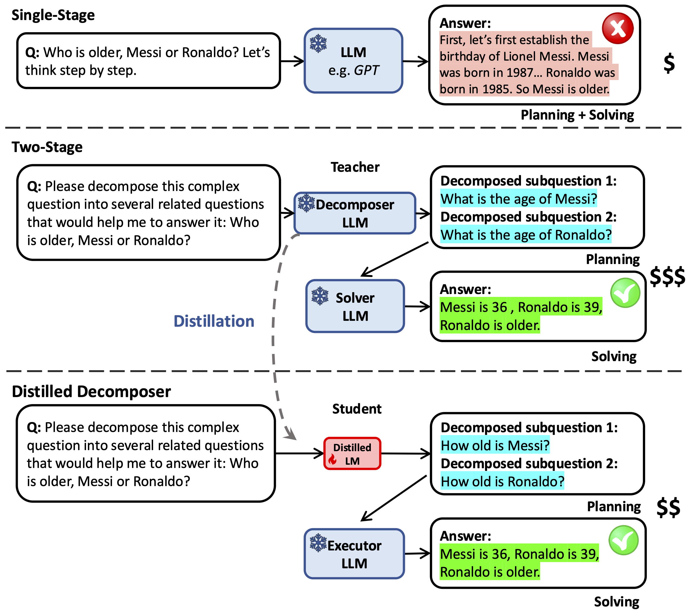

# Divide-or-Conquer

<div align="center">


This software project accompanies the research paper, [*Divide-or-Conquer*](https://arxiv.org/pdf/2402.15000).


*Zhuofeng Wu, He Bai, Aonan Zhang,*
*Jiatao Gu, VG Vinod Vydiswaran, Navdeep Jaitly, Yizhe Zhang*

[[`Paper`](https://arxiv.org/abs/2402.15000)]  [[`BibTex`](#citation)]




</div>

## Table of Contents

| Section | Description |
| - | - |
| [Introduction](#introduction) | A brief overview of Divide-or-Conquer project |
| [Installation](#installation) | The default installation dependencies |
| [Tutorial](#tutorials) | Step-by-step training of all mentioned models in the paper |


## Introduction
Large Language Models (LLMs), such as GPT-4 (OpenAI, 2023), demonstrate exceptional abilities in solving knowledge-intensive tasks like Open Domain QA, math, science and autonomous agents.

Wowever, the use of gigantic LLMs with hundreds of billions of parameters can be costly during inference, particularly when the reasoning chain generated is lengthy.

We devise a strategy that breaks down reasoning tasks into a problem decomposition phase and a problem solving phase and show that the strategy is able to outperform a single stage solution. We find
that we can distill the problem decomposition phase and at the same time achieve good generalization across tasks, datasets, and models.

## Installation
This package mainly follows [Vicuna](https://github.com/lm-sys/FastChat?tab=readme-ov-file#install)'s install package and [Mistral](https://github.com/mistralai/mistral-inference?tab=readme-ov-file#installation)'s install package as they are the main backbones we have used. 

## Tutorial
In this section, we will show how to train models mentioned in the paper. 

Once you've installed Vicuna or Mistral, download these checkpoints into the repo's directory.

As many scripts are similar and duplicate, we will mainly use bamboogle dataset as an example.
### Single Stage 
* prompt ask
```console
python3.11 run_bamb.py --model bamboogle_direct_qa --dataset bambooglesanity4 --backbone gpt-3.5-turbo --seed 0601 --gpu_id 0 --total_gpu 1 --qd none
```
* direct ask: delete prompt in function bamboogle_direct_qa compared with prompt_ask
```console
python3.11 run_bamb.py --model bamboogle_direct_qa --dataset bambooglesanity4 --backbone gpt-3.5-turbo --seed 0602 --gpu_id 0 --total_gpu 1 --qd none
python3.11 run_bamb.py --model bamboogle_direct_qa --dataset bambooglesanity4 --backbone vinilla_vicuna --seed 0602 --gpu_id 0 --total_gpu 1 --qd none
```
### Two Stage w/o training

* 1st stage - GPT QD:
Below includes the golden decomposition by various models:
```console
python3.11 run_gsm+drop.py --model gsm_cot_decompose --backbone gpt-3.5-turbo --dataset gsm8k --seed 11068 --gpu_id 0 --total_gpu 1
python3.11 run_gsm+drop.py --model cot_decompose --backbone gpt-3.5-turbo --dataset drop --seed 0123 --gpu_id 0 --total_gpu 1
python3.11 run_bamb.py --model bamboogle_cot_decompose --backbone gpt-3.5-turbo --dataset bamboogle --seed 0602 --gpu_id 0 --total_gpu 1
```

* 1st stage - Vicuna QD:
```console
python3.11 run_bamb.py --model bamboogle_cot_decompose --backbone vinilla_vicuna --dataset bamboogle --seed 0602 --gpu_id 0 --total_gpu 1
```

* 2nd stage - GPT QD + GPT QA:
```console
python3.11 run_gsm+drop.py --model gsm_cot_infer_0 --dataset gsm8ksanity4 --seed 11068 --backbone gpt-3.5-turbo --qd gpt-3.5-turbo 
python3.11 run_gsm+drop.py --model cot_infer_0 --dataset dropsanity4 --seed 0123 --backbone gpt-3.5-turbo --qd gpt-3.5-turbo 
python3.11 run_bamb.py --model bamboogle_direct_infer_0 --dataset bambooglesanity4 --seed 0602 --backbone gpt-3.5-turbo --qd gpt-3.5-turbo
```

* 2nd stage - GPT QD + Vicuna QA:
```console
python3.11 run_bamb.py --model bamboogle_direct_infer_0 --dataset bambooglesanity4 --seed 0602 --backbone vinilla_vicuna --qd gpt-3.5-turbo --gpu_id 0 --total_gpu 1
```

* 2nd stage - Vicuna QD + GPT QA:
```console
python3.11 run_bamb.py --model bamboogle_direct_infer_0 --dataset bambooglesanity4 --seed 0602 --backbone gpt-3.5-turbo --qd vinilla_vicuna --gpu_id 0 --total_gpu 1
```

### Two Stage w. training:
#### data preparation:
* $S_E\text{-}T$: 
```console
python3 newselect_correct_chain_bamb.py --b1 --full --qapath
```
* $S_E\text{-}A$:
```console
python3 newselect_correct_chain_bamb.py --g1 --full
```
* $S_D\text{-}T$:
```console
python3 newselect_correct_chain_bamb.py --zero_shot --full
```
* $S_D\text{-}R$:
```console
python3 newselect_correct_chain_bamb.py --zero_shot –d2
```

#### Vicuna fine-tuning:
After we construct corresponding training file from last section, we shall move them under playground/data/ folder in [FastChat](https://github.com/lm-sys/FastChat?tab=readme-ov-file#fine-tuning) repo. And you should follow it to install the packages for fine-tuning vicuna. 

#### Inference:
Once you finished fine-tuning and got the correct checkpoints from fine-tuning, you should direct the --backbone_path to your checkpoint folder.  
* GPT QA + $S_E\text{-}T$: 
```console
python3.11 run_bamb.py --model bamboogle_direct_infer_0 --dataset bambooglesanity4 --backbone bamboogle_ft_qd-0shot_vicuna-13b-v1.3 --backbone_path ${save_path} --gpu_id 0 --total_gpu 1 --seed 0602
```
* GPT QA + $S_E\text{-}A$:
```console
python3.11 run_bamb.py --model bamboogle_direct_infer_0 --dataset bambooglesanity4 --backbone bamboogle_ft_qd-0shot_vicuna-13b-v1.3 --backbone_path ${save_path} --gpu_id 0 --total_gpu 1 --seed 0602
```
* $S_D\text{-}T$ QD + GPT QA:
```console
python3.11 run_bamb.py --model bamboogle_cot_decompose --dataset bamboogle --backbone c_ft_qd-0shot_vicuna --backbone_path ${save_path} --gpu_id 0 --total_gpu 1 --seed 0602
python3.11 run_bamb.py --model bamboogle_direct_infer_0 --dataset bambooglesanity4 --seed 0602 --backbone gpt-3.5-turbo --qd c_ft_qd-0shot_vicuna
```
* $S_D\text{-}R$ QD + GPT QA:
```console
python3.11 run_bamb.py --model bamboogle_cot_decompose --dataset bamboogle --backbone d2_ft_qd-0shot_vicuna --backbone_path ${save_path} --gpu_id 0 --total_gpu 1 --seed 0602
python3.11 run_bamb.py --model bamboogle_direct_infer_0 --dataset bambooglesanity4 --seed 0602 --backbone gpt-3.5-turbo --qd d2_ft_qd-0shot_vicuna --gpu_id 0 --total_gpu 1
```

## Citation
If you find our work useful, please consider citing us as:
```
@article{wu2024divide,
  title={Divide-or-Conquer? Which Part Should You Distill Your LLM?},
  author={Wu, Zhuofeng and Bai, He and Zhang, Aonan and Gu, Jiatao and Vydiswaran, VG and Jaitly, Navdeep and Zhang, Yizhe},
  journal={arXiv preprint arXiv:2402.15000},
  year={2024}
}
```


